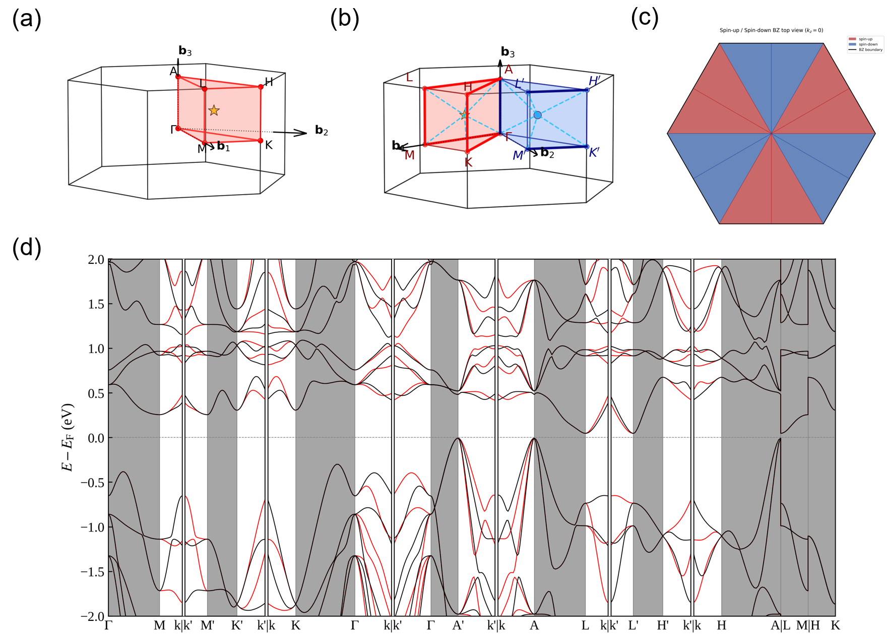

# AlterSeeK-Path

AlterSeeK-Path generates altermagnetic k-point paths for band-structure calculations. It inserts a general k point `k` and its spin-flip partner `k'` into a standard high-symmetry path, using the IBZ centroid as the default general point.



**Current support:** VASP workflows. Quantum ESPRESSO support is partial.

---

## Installation

```bash
git clone https://github.com/yujia-teng/AlterSeeK-Path.git
cd AlterSeeK-Path
pip install -r requirements.txt
pip install -e .
```

After editable installation, the installed commands are available from any
calculation directory in the same Python environment. You do not need to copy the
Python scripts into each material folder.

---

## Quick Start

Run the command-line tool from any working folder containing your structure file:

```bash
alterseek-path
```

For development, `python alterseek_path.py` still works from the repository root.

The script guides you through five interactive steps:

| Step | What it does | Input needed |
|------|--------------|--------------|
| **0** | Finds spin-flip symmetry operations and prints a compact symmetry summary | Structure file; magnetic moments for non-mcif inputs |
| **1** | Builds or reads the high-symmetry IBZ path | Press Enter for auto path, or enter a KPOINTS-style file |
| **2** | Chooses the general k point | Automatic IBZ centroid by default |
| **3** | Selects the spin-flip operation | Press Enter for default, enter a number, type `list`, or type `manual` |
| **4** | Builds the altermagnetic path | Automatic |
| **5** | Saves the output | Output filename |

The default output file is:

```text
KPOINTS_modified
```

For cluster screening, install AlterSeeK-Path once in the environment used by
your jobs, then run `alterseek-path` inside each material calculation directory.
The command reads and writes files in the current directory.

---

## Inputs

### Structure file

- `POSCAR` / `.vasp`: magnetic moments are entered manually.
- `.cif`: magnetic moments are entered manually.
- `.mcif`: magnetic moments are read from the file when available.

For manual moments, enter values in atom order. Trailing non-magnetic atoms are filled with zero automatically, so `1 -1` is enough when the two magnetic atoms appear first.

### K-path source

- Press Enter in Step 1 to auto-generate the path.
- Or enter a line-mode `KPATH.in` / KPOINTS-style file.

---

## Example Terminal Session

```text
$ python alterseek_path.py
=== Altermagnetic K-Path Generator ===

>>> Step 0: Spin symmetry
Enter structure file (default: POSCAR, supports .vasp/.cif/.mcif): POSCAR
Magnetic moments (atom order, trailing atoms auto-fill to 0): 1 -1

Structure: POSCAR, atoms: 6
Space Group: P6_3mc (186)
Point Group: 6mm
Laue Group: 6/mmm
Magnetic SG: BNS ..., type ...
Spin group: COLLINEAR(axis=[0. 0. 1.])
Operations: 12 total, 6 spin-flip, 6 spin-preserving
Saved: spin_operations.txt, spin_flip_operations.txt, spin_preserve_operations.txt

>>> Step 1: High-symmetry k-path
IBZ type: hP2
Path: GAMMA-M-K-GAMMA-A-L-H-A | L-M | H-K
Press [Enter] to use this path, or type a filename to load your own:
Using HPKOT hP2 path (9 segments, 18 k-points)

>>> Step 2: General k-point
IBZ centroid: [0.277778, 0.111111, 0.250000]

>>> Step 3: Spin-flip operation
Found 6 spin-flip operations.
Default R: Option 1
Press [Enter] to use default, type a number, 'list' to show matrices, or 'manual':
Selected: Option 1

>>> Step 4: Build altermagnetic path
k' = [-0.1111, 0.3889, 0.2500]
Generated path: GAMMA-M-k | k'-M'-K'-k' | k-K-GAMMA-k | ... | L-M | H-K
Full path: 9 original segments -> 13 generated segments, 36 k-points

>>> Step 5: Save
Enter output filename (default: KPOINTS_modified):
Modified KPOINTS file written to: KPOINTS_modified

Done.
```

---

## Output Files

| File | Description |
|------|-------------|
| `KPOINTS_modified` | Altermagnetic k-path for VASP line-mode band calculations |
| `spin_operations.txt` | Full spin-symmetry operation log |
| `spin_flip_operations.txt` | Spin-flip rotation matrices used by the main workflow |
| `spin_preserve_operations.txt` | Spin-preserving rotation matrices used for completion/diagnostics |
| `*_ibz_*.png` | IBZ/BZ figure with the selected general k point |
| `*_spinflip_*.png` | Spin-up/spin-down IBZ connection figure |
| `*_spinbz_*.png` | Spin-colored BZ figure |
| `*_spinbz_top_*.png` | Top-view spin-colored BZ figure |

BZ figures are written as PNG by default, which is usually enough for quick
checks and slides. To also write PDF copies for manuscript figures or
Illustrator editing, set:

```powershell
$env:ALTERSEEK_BZ_FORMATS = "png,pdf"
alterseek-path
```

For Laue groups `-1`, `-3`, and `m-3`, no altermagnetic splitting is supported. The code prints a note and writes the ordinary IBZ path.

---

## Band Plotting

After VASP and VASPKIT produce spin-resolved reformatted band files in the
calculation directory, go to that calculation directory and run either command:

```bash
alterseek-path bandplot
# or
alterseek-bandplot
```

`alterseek-bandplot` is only a shorter standalone shortcut. It calls the same
band-plotting code as `alterseek-path bandplot`.

By default this reads:

```text
KLABELS
REFORMATTED_BAND_UP.dat
REFORMATTED_BAND_DW.dat
```

and writes:

```text
alterband.png
```

### Plot settings with `alterband.toml`

If a file named `alterband.toml` exists in the same directory, the band plotter
uses it automatically. A typical file is:

```toml
emin = -2
emax = 2
fig_width = 16
fig_height = 5
gap_frac = 0.004
rotate_xtick_labels = false
xtick_rotation = 45
output = "alterband.png"
```

Then run:

```bash
alterseek-bandplot
```

Command-line options override the TOML file. For example, this uses the TOML
energy window and figure size, but writes a PDF:

```bash
alterseek-bandplot -o alterband.pdf
```

### PNG and PDF outputs

Matplotlib chooses the file format from the output extension. Use PNG for quick
checks and PowerPoint slides:

```bash
alterseek-path bandplot -o alterband.png
```

Use PDF for manuscript figures and Adobe Illustrator editing:

```bash
alterseek-path bandplot -o alterband.pdf
```

If you want both outputs, run the command twice:

```bash
alterseek-bandplot -o alterband.png
alterseek-bandplot -o alterband.pdf
```

Optional arguments:

```bash
alterseek-path bandplot --emin -3 --emax 3 -o my_band.png
alterseek-path bandplot --klabels KLABELS --up REFORMATTED_BAND_UP.dat --down REFORMATTED_BAND_DW.dat
```

---

## Additional Utilities

Standalone spin-flip analysis:

```bash
python find_sf_operations.py
```

IBZ centroid and BZ visualization for one structure:

```bash
python compute_centroid_hybrid.py POSCAR
```

Monoclinic IRBZ vertex diagnostic:

```bash
python find_irbz_vertices.py
```

---

## Requirements

- Python >= 3.9
- See `requirements.txt`

```bash
pip install -r requirements.txt
```

---

## Citation

```bibtex
@article{v3fg-6smc,
  title = {$G$-type antiferromagnetic ${\mathrm{BiFeO}}_{3}$ is a multiferroic $g$-wave altermagnet},
  author = {Urru, Andrea and Seleznev, Daniel and Teng, Yujia and Park, Se Young and Reyes-Lillo, Sebastian E. and Rabe, Karin M.},
  journal = {Phys. Rev. B},
  volume = {112},
  issue = {10},
  pages = {104411},
  numpages = {14},
  year = {2025},
  month = {Sep},
  publisher = {American Physical Society},
  doi = {10.1103/v3fg-6smc},
  url = {https://link.aps.org/doi/10.1103/v3fg-6smc}
}
```
